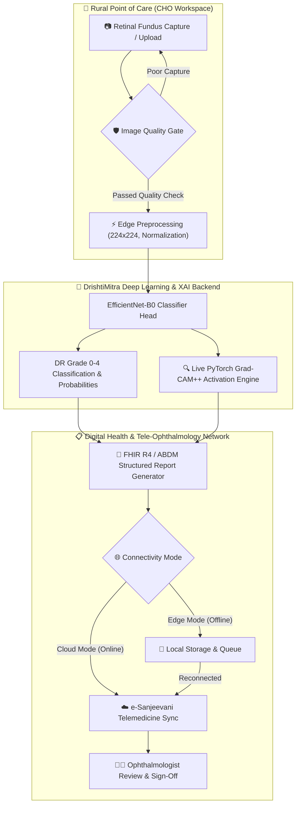

# 👁️ DrishtiMitra — Retina-XAI
### *Explainable AI for Diabetic Retinopathy Screening in Rural India*

[](https://sih.gov.in/)
[](https://sih.gov.in/)
[](https://pytorch.org/)
[](https://fastapi.tiangolo.com/)
[](https://react.dev/)
[](https://tailwindcss.com/)
[](LICENSE)

---

## 📌 Executive Summary

**DrishtiMitra (Retina-XAI)** is an offline-first, Explainable AI-assisted screening companion engineered to revolutionize **Diabetic Retinopathy (DR)** triage at rural primary health centers in India. Designed specifically for **Community Health Officers (CHOs)**, DrishtiMitra fills the critical gap between rural point-of-care screening and urban tele-ophthalmology experts.

By combining a **PyTorch EfficientNet-B0** deep learning classifier with **real-time Grad-CAM++ visual attention maps**, automated image quality safeguards, and **FHIR R4 / ABDM-compliant interoperable reporting**, DrishtiMitra ensures transparent, trustworthy AI triage with seamless **e-Sanjeevani** specialist escalation.

---

## 🎯 Key Challenges & Problem Context (SIH26038)

- **77 Million+** diabetic patients in India facing risk of permanent vision loss.
- **13.2%** prevalence of adult diabetes in rural Indian communities.
- **<50%** of rural diabetic patients complete recommended annual eye screenings due to remote geography and severe scarcity of ophthalmologists.
- **Cost Barrier**: Estimated **₹2,400+** avoided downstream treatment cost per patient with early point-of-care detection.

---

## 🔥 Key Innovations & Core Features

- 🧠 **Deep Learning DR Grading**: Classifies fundus images into **5 DR Grades** (Grade 0: No DR to Grade 4: Proliferative DR) using transfer learning on **EfficientNet-B0**.
- 🔍 **Live PyTorch Grad-CAM++ Visual Explainability**: Computes real-time spatial feature activation heatmaps on `model.features[-1]`, visually highlighting hemorrhages and exudates to eliminate black-box AI opacity.
- 🛡️ **Automated Quality Gate Safeguard**: Evaluates fundus capture quality before preprocessing to reject blurred/corrupted images and guide instant recapture.
- 🌐 **Offline-First Edge Inference**: Operates completely offline at rural health posts without internet connection; queues records for automatic cloud sync when reconnected.
- 🏥 **FHIR R4 & ABDM Digital Health Interoperability**: Generates structured, FHIR-compliant screening records (`Patient`, `Observation`, `DiagnosticReport`, `ServiceRequest`) ready for **e-Sanjeevani** tele-ophthalmology escalation.
- 👨‍⚕️ **Human-in-the-Loop Workflow**: Empowers doctors to review AI predictions alongside visual evidence before giving final clinical sign-off.

---

## 🏗️ System Architecture



---

## 🔬 Model Architecture & Training Details

### Neural Network Backbone
- **Model**: `EfficientNet-B0` (ImageNet transfer learning)
- **Classifier Head**: `Dropout(p=0.3)` + `Linear(1280 -> 5 classes)`
- **Input Size**: `224 x 224 x 3` (RGB Fundus Input)
- **Class Labels**:
  - `Grade 0`: No apparent DR
  - `Grade 1`: Mild DR
  - `Grade 2`: Moderate DR
  - `Grade 3`: Severe DR
  - `Grade 4`: Proliferative DR

### Training Methodology
- **Dataset**: Indian Diabetic Retinopathy Image Dataset (**IDRiD**)
  - Total Images: **455 Fundus Images**
  - Train/Validation Split: **375 Images** (300 Train / 75 Validation)
  - Held-Out Test Set: **80 Patient Images**
- **Loss Function**: `CrossEntropyLoss` with mean-one inverse frequency class weighting and `0.05` label smoothing to overcome class imbalance across DR grades.
- **Optimization**: `AdamW` (learning rate: `3e-4`, weight decay: `1e-4`) with `CosineAnnealingLR` scheduler and PyTorch Mixed Precision (AMP).

### Evaluation Benchmarks

| Metric | Validation Set | Held-Out Test Set | Target Benchmarks |
| :--- | :---: | :---: | :---: |
| **Quadratic Weighted Kappa (QWK)** | **0.680** | **0.434** | `> 0.90` (Phase 2 Clinical Target) |
| **Overall Accuracy** | **48.0%** | **37.5%** | `> 90%` |
| **Balanced Accuracy** | **36.3%** | **32.4%** | `> 90%` |
| **Macro F1-Score** | **35.9%** | **28.2%** | `> 0.85` |

---

## 📱 Guided CHO Screening Workflow (5-Step Pipeline)

```
 [1] Capture ➔ [2] Quality Gate ➔ [3] AI Analysis ➔ [4] XAI Evidence ➔ [5] FHIR Report & Refer
```

1. **Step 1: Patient Registration & Capture**
   - CHO registers patient demographic details and uploads/captures retinal fundus image.
2. **Step 2: Quality Gate Assessment**
   - System checks image quality to ensure clear visualization of optic disc and macula.
3. **Step 3: AI Screening & Grading**
   - Local FastAPI inference returns predicted DR grade (0-4), top confidence, and class probabilities.
4. **Step 4: Explainable AI (XAI) Evidence**
   - Displays live **Grad-CAM++ heatmaps** highlighting exact retinal regions (microaneurysms, hemorrhages, hard exudates) driving the AI prediction.
5. **Step 5: FHIR Report & Telemedicine Referral**
   - Generates structured FHIR-compliant reports and queues priority referrals (`REF-DM-xxxx`) for e-Sanjeevani specialist review.

---

## 📁 Repository Structure

```
drishtiMitra/
├── archive/
│   ├── Imagenes/
│   │   └── Imagenes/           # IDRiD fundus image dataset (455 .jpg files)
│   ├── sample/                 # Sample reference case images
│   └── idrid_labels.csv        # Dataset labels (id_code, diagnosis grade 0-4)
├── artifacts/
│   ├── drishtimitra_efficientnet_b0.pt # Saved PyTorch model checkpoint
│   └── training_metrics.json          # Detailed evaluation metrics log
├── backend/
│   ├── server.py               # FastAPI inference service & Grad-CAM engine
│   ├── train.py                # PyTorch training & evaluation script
│   └── requirements.txt        # Python backend dependencies
├── src/
│   ├── components/             # React UI components (FundusViewer, EvidenceViewer, etc.)
│   ├── data/                   # Demo case data & grade definitions
│   ├── App.tsx                 # Main application workflow logic
│   ├── main.tsx                # React entry point
│   ├── styles.css              # Tailwind CSS styles
│   └── types.ts                # TypeScript interface definitions
├── index.html                  # HTML entry template
├── package.json                # Frontend Node.js dependencies
├── vite.config.ts              # Vite build configuration
├── README.md                   # Project documentation
└── .gitignore                  # Git untracked pattern rules
```

---

## ⚡ Quick Start & Installation Guide

### Prerequisites
- **Node.js**: v18.0 or higher
- **Python**: v3.10 or higher
- **Git**

---

### Step 1: Clone Repository
```bash
git clone https://github.com/the-akshay-tiwari/DrishtiMitraAI.git
cd DrishtiMitraAI
```

---

### Step 2: Set Up Python Backend Environment
```bash
# Create virtual environment
python -m venv .venv

# Activate virtual environment
# Windows:
.venv\Scripts\activate
# Linux/macOS:
source .venv/bin/activate

# Install dependencies
pip install torch torchvision fastapi uvicorn pillow scikit-learn numpy
```

---

### Step 3: Run Local FastAPI Backend Server
```bash
python -m uvicorn backend.server:app --reload --host 127.0.0.1 --port 8000
```
- **Health Check API**: [http://127.0.0.1:8000/health](http://127.0.0.1:8000/health)
- **Interactive Swagger Docs**: [http://127.0.0.1:8000/docs](http://127.0.0.1:8000/docs)

---

### Step 4: Set Up & Run React Frontend App
Open a **new terminal window** in the project directory:

```bash
# Install frontend dependencies
npm install

# Start Vite development server
npm run dev
```
Open [http://localhost:5173](http://localhost:5173) in your browser.

---

## 🧪 Training Model from Scratch (Optional)

To re-train the PyTorch EfficientNet-B0 model on the bundled IDRiD dataset:

```bash
python backend/train.py --epochs 20 --batch-size 16 --learning-rate 3e-4
```
The script will evaluate model checkpoints on the validation split and save the best checkpoint to `artifacts/drishtimitra_efficientnet_b0.pt` alongside `artifacts/training_metrics.json`.

---

## 🔗 Live API Endpoints

### 1. GET `/health`
Returns backend status, active compute device (`cuda` or `cpu`), and loaded model checkpoint path.

### 2. POST `/predict`
Accepts a multipart fundus image upload (`image/jpeg` or `image/png`).

**Response Payload:**
```json
{
  "grade": 3,
  "label": "Severe DR",
  "confidence": 0.8924,
  "probabilities": {
    "0": 0.012,
    "1": 0.031,
    "2": 0.064,
    "3": 0.8924,
    "4": 0.0006
  },
  "heatmap": "data:image/png;base64,iVBORw0KGgoAAAANSUhEUgAAAO...",
  "medical_disclaimer": "Experimental research output only. A qualified ophthalmologist must make the clinical decision."
}
```

---

## 🩺 Medical Safety & Regulatory Disclaimer

> [!CAUTION]
> **Research Prototype Only**: DrishtiMitra is an experimental research decision-support tool created for Smart India Hackathon 2026. It is **not** a validated clinical diagnostic software and is not intended to provide autonomous medical diagnoses. All AI-generated screening recommendations, confidence scores, and Grad-CAM++ heatmaps **must** undergo verification and final clinical sign-off by a licensed tele-ophthalmologist or medical specialist.

---

## 📜 Team & License

- **Hackathon**: Smart India Hackathon 2026
- **Problem Statement Title**: Explainable AI for Diabetic Retinopathy Screening in Rural India (SIH26038)
- **Team Name**: DrishtiMitra
- **License**: Released under the [MIT License](LICENSE).
